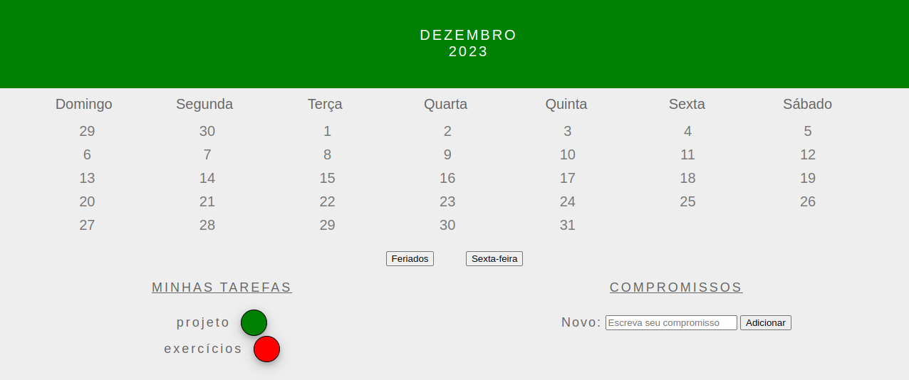

# README: Tryber Calendar



<br/>

[Page link](https://feduarte-dev.github.io/tryber-calendar/)

## Project Description

This project is a December calendar that allows users to interact by adding appointments, selecting holidays, and more. The exercise involves writing code that selects an HTML tag and changes its styles or content.

### Technologies

- LINUX
- VSCODE
- JAVASCRIPT
- HTML
- CSS

### What I Learned

- How to iterate over many html tags and change its content
- How to dinamicaly add or remove class
- How to work with mouse/keyboard events

## How to Run the Project

1. Clone the repository:

   ```bash
   git clone https://github.com/feduarte-dev/tryber-calendar
   ```

2. Navigate to the project directory:

   ```bash
   cd your-repository
   ```

3. Install dependencies:

   ```bash
   npm install
   ```

4. Right click index.html and open it with live server

## Contributions

[Felipe](https://www.linkedin.com/in/feduarte-dev/) - /script.js


[Trybe](https://www.betrybe.com/) - Everything else
